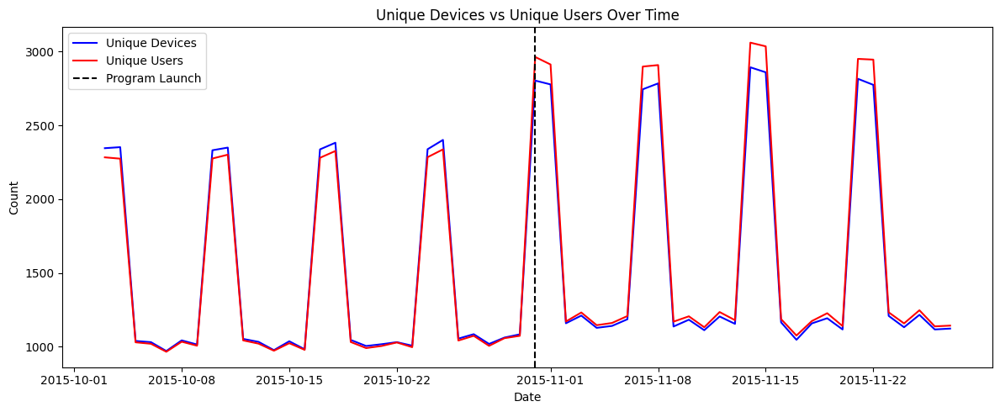
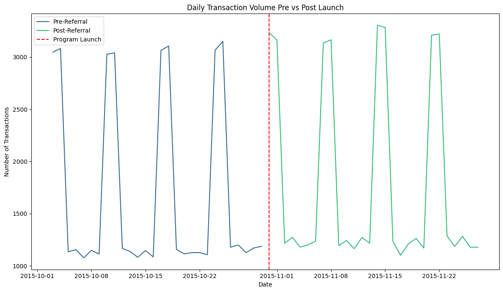
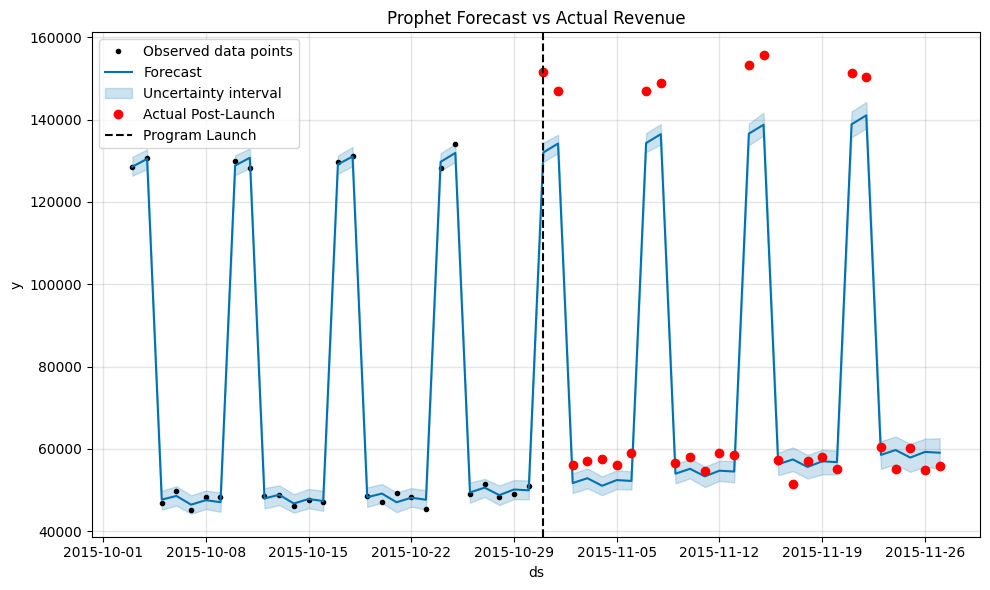
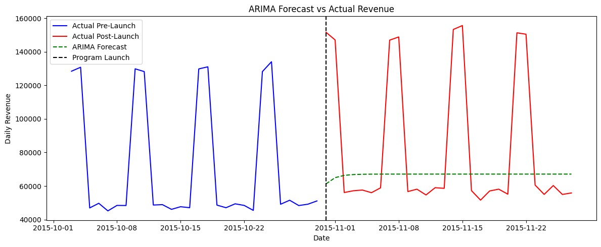

# 📊 User Referral Program Analysis

> **An end-to-end data analytics project** evaluating the effectiveness of a user referral program launched on October 31, 2015 — analyzing user growth, transaction volumes, spend behavior, fraud signals, and program economics using statistical hypothesis testing and time series forecasting.

[](https://python.org)
[](https://pandas.pydata.org)
[](https://scipy.org)
[](https://facebook.github.io/prophet/)
[](https://jupyter.org)
[](LICENSE)

---

## 📌 Project Overview

Company XYZ launched a referral program offering existing users **$10 in credit** when a referred user completes a purchase. After nearly one month of operation, the Growth Product Manager needed a data-driven assessment to present to leadership.

This project performs a full pre/post analysis of the program's impact, comparing key metrics before and after launch, segmenting by referral status and country, applying statistical hypothesis testing, and using time series forecasting (Prophet + ARIMA) to estimate counterfactual revenue.

---

## 🎯 Business Questions

1. Did the referral program drive meaningful user growth?
2. Do referred users spend more than non-referred users?
3. Did overall platform spend increase after launch?
4. Is the $10 credit economically justified?
5. Which markets show the strongest referral adoption?
6. Is there evidence of fraud or cannibalization?

---

## 📁 Dataset

| Column | Description |
|--------|-------------|
| `user_id` | Unique identifier for each user |
| `date` | Date of the purchase transaction |
| `country` | User's country based on IP address |
| `money_spent` | Amount spent in USD |
| `is_referral` | Binary flag (1 = referred, 0 = organic) |
| `device_id` | Device used to make the purchase |

- **Total records:** 97,341
- **Date range:** October 3 – November 27, 2015
- **Countries:** CA, CH, DE, ES, FR, IT, MX, UK, US

---

## 🔍 Analysis Workflow

### 1. Data Cleaning & EDA
- Identified and removed exact duplicate records
- Converted date column to datetime
- Sorted by user and date, assigned each user their first recorded `is_referral` value to fix users appearing in both groups
- Verified referral/non-referral distribution (71% / 29%)

### 2. Pre/Post Split
- **Pre-launch:** October 3 – October 30
- **Post-launch:** November 1 – November 27
- ~4 weeks each — symmetric comparison window

### 3. Spend & Volume Analysis
- Time series: avg daily spend by referral status (pre and post)
- Line chart: daily transaction volume pre vs post launch (with Oct 31 launch marker)
- Line chart: unique devices vs unique users over time (fraud signal)

- Bar chart: avg spend by country and referral status
- Bar chart: overall avg spend pre vs post launch


### 4. Country Analysis
- Referral adoption rate by country
- Avg spend comparison across markets

### 5. Statistical Hypothesis Testing

**H1 — Referral vs Non-Referral Spend (Post-Launch)**
- H₀: Mean spend is equal for referral and non-referral users
- H₁: Mean spend is greater for referral users
- Result: t=0.596, p=0.275 — **Fail to reject H₀**

**H2 — Daily User Growth**
- H₀: Mean daily unique users pre-launch = post-launch
- H₁: Mean daily unique users increased after launch
- Result: t=1.586, p=0.059 — **Fail to reject H₀ (borderline)**

**H3 — Overall Spend Lift**
- H₀: Mean spend per transaction pre-launch = post-launch
- H₁: Mean spend increased after launch
- Result: t=30.89, p≈0.000 — **Reject H₀**

### 6. Program Economics
- Total referral transactions: 28,133
- Total credit cost: $281,330
- Incremental spend (referral vs non-referral): $0.13
- **Net per referral transaction: -$9.87**

### 7. Time Series Forecasting

**Prophet**
- Trained on pre-launch daily revenue
- Forecast through Nov 27 with 95% confidence interval
- Actual post-launch revenue ($83,710/day) significantly exceeded forecast ($78,637/day)
- Paired t-test: t=3.955, p=0.0005


**ARIMA(1,1,1)**
- ADF test confirmed non-stationarity (p=0.998) — d=1 required
- Forecast flattened weekly seasonality pattern — underestimated baseline
- Prophet more reliable for this dataset due to built-in weekly seasonality handling


---

## 📈 Key Findings

1. **Referred users do not spend more** — Only $0.13 incremental spend vs non-referred users (p=0.275), insufficient to justify the $10 credit cost
2. **Program is running at a loss** — Net loss of $9.87 per referral transaction, $281,330 total credit cost in month one
3. **User growth is promising but unconfirmed** — Positive trend at p=0.059, just short of significance; needs 8–12 weeks of data to confirm
4. **Overall spend lifted significantly** — $42.39 → $46.96 avg spend (p≈0.000), confirmed by Prophet forecasting (p=0.0005), but seasonality cannot be ruled out as the primary driver
5. **Fraud/Cannibalization detected** — Post-launch, unique users exceeded unique devices — a reversal of the pre-launch pattern, suggesting existing users created new accounts to exploit the $10 credit
6. **Top referral markets:** IT, MX, ES, FR (~31% adoption); **Weakest:** DE, CH (~23%)

---

## 💡 Recommendations

1. **Do not scale the program** — Reduce credit from $10 to $5 or make it conditional on the referred user's second purchase to improve unit economics
2. **Address fraud immediately** — Implement device fingerprinting or phone verification to prevent existing users from creating multiple accounts to claim referral credits
3. **Run a proper A/B test** — Current analysis cannot isolate program impact from seasonal factors; a randomized control group is required before further investment
4. **Retest user growth at 8–12 weeks** — The borderline p=0.059 result needs more data for a conclusive finding
5. **Analyze lifetime value** — Referred users may retain better over time, potentially justifying the acquisition cost
6. **Focus on high-adoption markets** — Double down on IT, MX, ES, FR; investigate barriers in DE and CH through localized incentive testing
7. **Test alternative incentive structures** — Tiered credits, dual-sided rewards, or non-monetary incentives to improve unit economics without sacrificing growth

---

## 🛠 Tech Stack

- **Python** — pandas, numpy, scipy, matplotlib, seaborn
- **Forecasting** — Prophet (Meta), statsmodels ARIMA
- **Statistical Testing** — independent samples t-test, paired t-test, ADF stationarity test
- **Jupyter Notebook** — analysis and visualization

---

## 🚀 Getting Started

```bash
# Clone the repo
git clone https://github.com/tbhatti211-wq/referral-program-analysis.git
cd referral-program-analysis

# Install dependencies
pip install -r requirements.txt

# Launch notebook
jupyter notebook referral_analysis.ipynb
```

---

## 📂 Project Structure

```
referral-program-analysis/
│
├── data/
│   └── referral.csv              # Raw dataset
│
├── referral_analysis.ipynb       # Main analysis notebook
├── requirements.txt              # Python dependencies
└── README.md
```

---

## 👤 Author

**Talib Hussain**
- GitHub: [@tbhatti211-wq](https://github.com/tbhatti211-wq)
- Email: tbhatti211@gmail.com